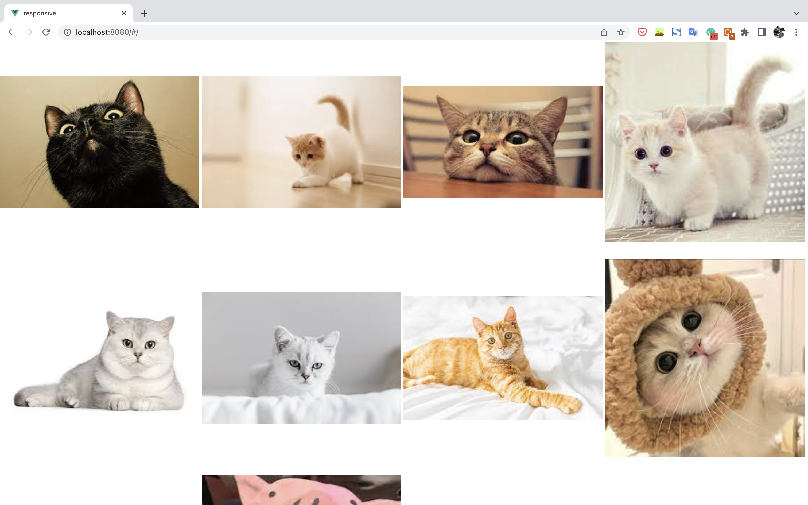
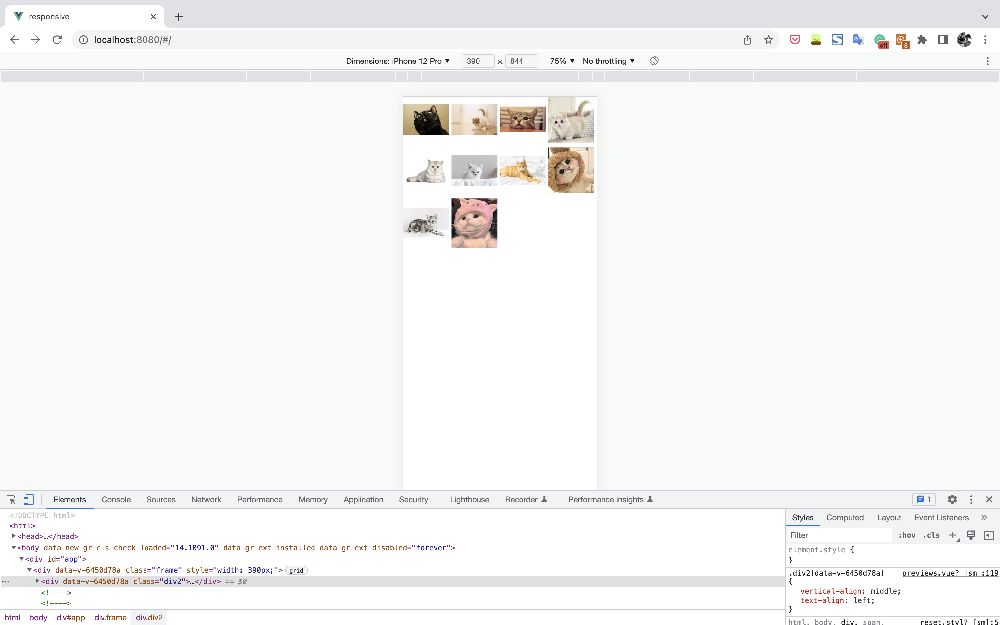
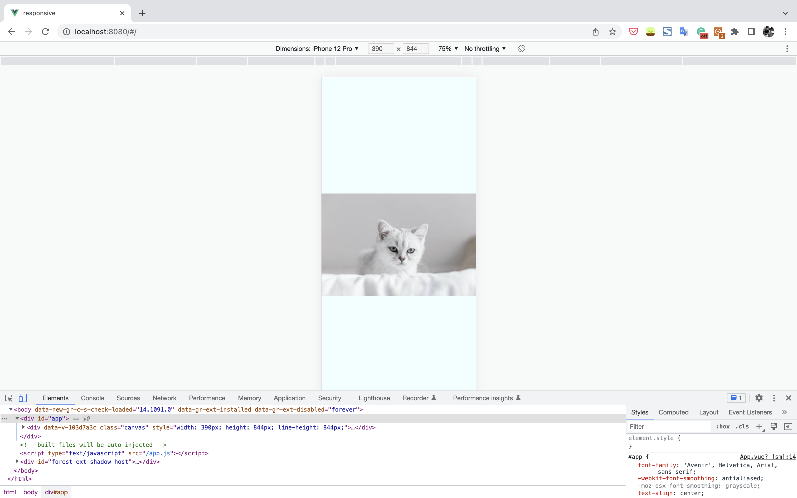

# Album-v1

It consists of two pages. Previews and viewers.

## Previews
The previews page looks like:

It's responsive. When on iphone 12 pro, it looks like:

## Viewers
When click on one picture on previews page, the viewer shows up with the target picture.

It's also responsive.

On viewers page, the pictures can be slide to left or right and the picture aside it shows up.

## TODO
Change the slide effect to 3D trunning page effect